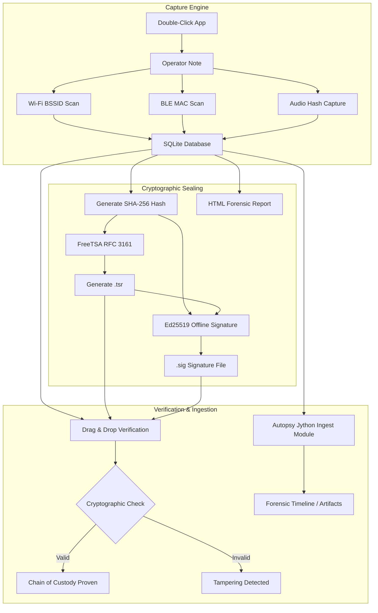

# Digital Alibi - AI Memory & Architecture

## Project Overview
Digital Alibi is a cross-platform, zero-installation forensic utility designed to capture ambient environmental data (Wi-Fi BSSIDs, Bluetooth MACs, and ambient audio hashes) and cryptographically seal it to prove a device's physical location and temporal state at a specific moment.

## Core Architecture & Workflow
1. **Capture Phase (Zero-Friction UI):**
   - **Interactive Mode**: Double-clicking the executable launches an interactive terminal prompting the operator for a custom note. No CLI arguments required.
   - **Hardware Scans**:
     - *Wi-Fi*: Uses `nmcli` (Linux - patched for colon escaping), `netsh` (Windows), and `airport` (macOS).
     - *Bluetooth*: Uses `bleak` for async BLE beacon discovery.
     - *Audio*: Captures 5 seconds of ambient audio via `sounddevice`, hashes it (SHA-256), and immediately discards the raw audio to preserve privacy.
2. **Storage & Reporting:**
   - Data is stored in `digital_alibi.sqlite`.
   - Automatically generates a forensic `Digital_Alibi_Report.html` presenting all captured BSSIDs, BLE MACs, and cryptographic hashes in a clean, truncation-free table.
3. **Cryptographic Sealing Pipeline:**
   - **Hash**: The SQLite DB is hashed using SHA-256.
   - **Timestamp**: The hash is sent to FreeTSA (RFC 3161) to receive a cryptographically secure TimeStampResponse (`.tsr`).
   - **Signature**: The DB hash + TimeStamp are signed using an offline Ed25519 private key (generating `.sig`).
4. **Verification (Drag-and-Drop):**
   - The user drags and drops `digital_alibi.sqlite` onto the executable.
   - The app auto-detects the `.sqlite` extension, switches to Verify Mode, reconstructs the hashes, validates the FreeTSA certificate chain, and cryptographically verifies the Ed25519 signature.

## Autopsy Integration (Jython)
- An Ingest Module (`Autopsy_DigitalAlibi_Ingest.py`) parses the `.sqlite` file during a forensic disk image analysis.
- **Critical Fixes Applied**: 
  - Overcame a BouncyCastle `TimeStampResponse` unwrapping error specific to Autopsy's internal Java classpath.
  - Removed deprecated `fireModuleDataEvent` calls that caused silent GUI crashes.
  - Successfully posts artifacts to the "Interesting Items" tree.

## Updated Mermaid Architecture

## Known Quirk Solutions
1. **Ubuntu `nmcli` escaping**: Ubuntu escapes colons in MAC addresses (e.g., `\\:`); fixed by enforcing `--escape no`.
2. **PyInstaller UI**: Executables must be rebuilt (`build_forensic_usb.py`) whenever UI logic changes to bake it into the ELF/PE binaries.
3. **Logo padding**: Scaling key geometries requires internal proportional thickening rather than global scaling to maintain crest padding.
