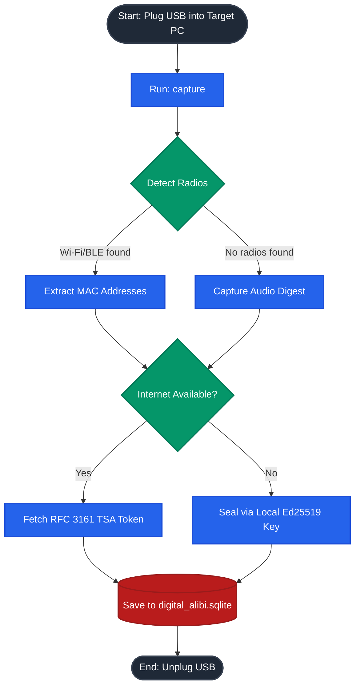
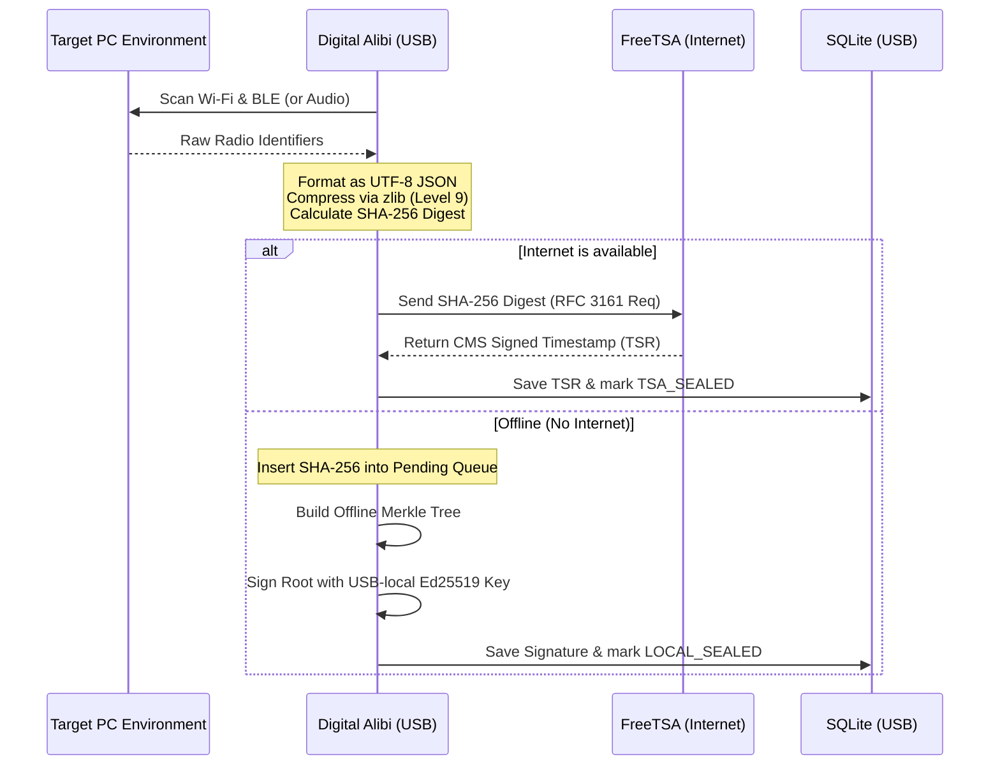

# Digital Alibi

**Digital Alibi** is a portable, authorised-live-triage utility for making a cryptographically bound record of nearby radio identifiers and, only when no usable radios are found, an in-memory ambient-audio fingerprint. It writes evidence only to the investigator-selected **current working directory**, normally a case folder on a USB drive.

> **Author:** Developed by **Junaid Nizam Quadri**, M.Tech in Information Security and Cyber Forensics.  
> **Version:** 1.0.0  
> **Use:** Authorised forensic collection only. Nearby device identifiers and ambient audio can be personal data. Obtain legal authority, follow local policy, document operator actions, and preserve chain of custody.

## 1. Forensic scope and important limits

Digital Alibi is an **evidence-assistance tool**, not a determination of physical location, identity, guilt, or ownership.

- A Wi-Fi BSSID or BLE address indicates radio visibility, not a person’s identity or exact location.
- BLE addresses may rotate. Digital Alibi retains only MAC-form identifiers observed in **two separate scans**. On macOS, CoreBluetooth commonly exposes privacy UUIDs rather than physical MAC addresses, and those UUIDs are intentionally excluded.
- Audio fallback retains no WAV, PCM, or recording file. It captures audio **only in memory**, hashes the PCM bytes, stores the digest and capture parameters, then releases the sample. The audio hash itself may still be sensitive evidence.
- RFC 3161 proves that a timestamp authority issued a token over the supplied digest. It does not independently prove how the digest was acquired. The collection process, operator notes, media handling, and verification records remain essential.
- A locally generated Ed25519 signature establishes tamper evidence after the USB-local key was created. It is not a substitute for an independently trusted TSA timestamp.

### Zero-footprint definition

The core program confines every application-created persistent artifact to `os.getcwd()`:

| Artifact | Location |
|---|---|
| SQLite evidence database | `./digital_alibi.sqlite` |
| RFC 3161 tokens | `./tsr/<capture-id>.tsr` |
| USB-local offline signing key | `./digital_alibi_ed25519_private.pem` |
| USB-local public key | `./digital_alibi_ed25519_public.pem` |
| SQLite rollback journal, if created | alongside the database in the current directory |

The program rejects resolved output paths outside the current directory and does not use Python’s system temporary directory. SQLite is configured with `journal_mode=DELETE` and `synchronous=FULL` to avoid persistent WAL/SHM files and favour durable commits on removable media.

**Boundary of that guarantee:** Digital Alibi cannot prevent the operating system, a Wi-Fi stack, Bluetooth daemon, audio driver, endpoint-security product, shell history, or a third-party library from maintaining its own state. Use a validated clean acquisition environment, review OS policy, and test on your intended target hardware before relying on any “zero footprint” claim.

## 2. Architecture and Workflow



## 3. What it collects

| Source | Method | Stored evidence |
|---|---|---|
| Wi-Fi | Native OS command only: `netsh wlan`, `nmcli`, or `airport -s` | Sorted, de-duplicated BSSIDs, command outcome metadata |
| Bluetooth LE | `bleak`, two scans, intersection of MAC-form identifiers | Stable BLE hardware MACs and available RSSI values |
| Audio fallback | `sounddevice`, 16 kHz mono PCM signed 16-bit, 10 seconds by default | SHA-256 of in-memory PCM, sample parameters, no audio content |

No custom radio drivers, monitor mode, packet capture, SSIDs, BLE names, audio files, cloud uploads, or user-profile logs are intentionally used.

## 4. Evidence format and cryptographic design



Each capture contains a canonical evidence object with:

- schema identifier: `digital-alibi.evidence/v1`
- randomly generated capture ID, unless supplied by the operator
- UTC capture timestamp
- platform system, release, and machine fields
- Wi-Fi BSSIDs, stable BLE records, and optional audio fingerprint
- acquisition method/error metadata and optional operator note

### Canonicalisation and evidence digest

1. The evidence object is encoded as UTF-8 JSON with sorted keys and compact separators: `json.dumps(..., ensure_ascii=False, sort_keys=True, separators=(',', ':'))`.
2. The canonical JSON is compressed with zlib level 9.
3. The **exact compressed byte sequence** is stored as Base64 in `captures.compressed_payload_b64`.
4. `captures.compressed_sha256` is SHA-256 of those exact compressed bytes.
5. The program checks both the SHA-256 and that decompressing the stored byte sequence yields the canonical JSON. Keeping the exact byte sequence avoids false verification failures caused by different zlib implementations on another platform.

The SHA-256 digest is the RFC 3161 message imprint and the leaf value used by the offline Merkle tree.

### Online seal

By default, `capture` sends a DER RFC 3161 `TimeStampReq` over HTTPS to the configured TSA URL. The default is `https://freetsa.org/tsr`. A successful response is minimally sanity-checked as a granted DER `TimeStampResp`, saved as `tsr/<capture-id>.tsr`, and recorded as `TSA_SEALED`.

Digital Alibi stores the received token but does **not** claim to fully validate TSA signing chains during collection. Independent verification, including the pinned trust chain and revocation policy appropriate to the case, is performed later in Autopsy or with a dedicated forensic verification workflow.

### Offline seal and reconnection retry

If the TSA is unavailable, or `--no-tsa` is selected:

1. Pending capture hashes are sorted.
2. A binary SHA-256 Merkle tree is built, duplicating the final leaf at each odd level.
3. The root is signed with an Ed25519 key generated and retained on the USB case directory.
4. The signed root, leaves, public key DER, key fingerprint, and signature are saved to `merkle_batches`.
5. The affected captures become `LOCAL_SEALED`.

`capture` automatically tries existing pending/local evidence before it gathers a new capture. To automatically retry while connectivity changes, leave the USB-launched process running:

```text
DigitalAlibi-<platform>/DigitalAlibi-<platform> watch --interval 60
```

`watch` is deliberately not a host-installed service, login item, scheduled task, or daemon. It writes no retry state outside the USB working directory. Use `flush` for a one-time retry.

## 5. Investigator quick start from a USB drive

### Recommended USB layout

```text
USB_ROOT/
├── DigitalAlibi-linux-x86_64/       # native PyInstaller onedir bundle
│   └── DigitalAlibi-linux-x86_64
├── DigitalAlibi-windows-x86_64/     # Windows bundle built on Windows
│   └── DigitalAlibi-windows-x86_64.exe
├── DigitalAlibi-darwin-arm64/       # macOS bundle built on macOS ARM
│   └── DigitalAlibi-darwin-arm64
└── CASE-2026-001/                   # start the executable from here
```

The bundle and the case directory may both be on the USB, but **start the command with the case directory as the current directory**. That is what causes all evidence artifacts to land in `CASE-2026-001`.

### Windows

Open Command Prompt from the USB and run:

```bat
E:
cd \CASE-2026-001
..\DigitalAlibi-windows-x86_64\DigitalAlibi-windows-x86_64.exe capture --note "Operator initials, authority reference, scene"
```

If elevated permissions are required for the radio or microphone policy, record the elevation in your case notes. Do not install the application or dependencies on the target.

### Linux

```bash
cd /media/INVESTIGATOR_USB/CASE-2026-001
../DigitalAlibi-linux-x86_64/DigitalAlibi-linux-x86_64 capture \
  --note "Operator initials, authority reference, scene"
```

The Linux target needs NetworkManager with `nmcli` for Wi-Fi visibility, a permitted BlueZ/DBus path for BLE, and a usable PortAudio input device for audio fallback. If a capability is unavailable, the payload records an acquisition error instead of silently inventing a result.

### macOS

```bash
cd /Volumes/INVESTIGATOR_USB/CASE-2026-001
../DigitalAlibi-darwin-arm64/DigitalAlibi-darwin-arm64 capture \
  --note "Operator initials, authority reference, scene"
```

macOS may require Location Services, Bluetooth, and Microphone approval. The legacy `airport` utility path can be absent on some macOS versions. Treat unavailability as documented negative capability, not proof that no access points exist.

### Commands

```text
capture [--tsa-url HTTPS_URL] [--no-tsa] [--ble-seconds N]
        [--audio-seconds N] [--capture-id ID] [--note TEXT]
flush   [--tsa-url HTTPS_URL] [--limit N]
watch   [--tsa-url HTTPS_URL] [--interval SECONDS]
verify  [--capture-id ID]
status
```

Examples:

```bash
# Explicitly offline collection. No TSA connection is attempted.
DigitalAlibi-linux-x86_64 capture --no-tsa --capture-id CASE001-SCENE-A-001

# Retry all pending/local timestamp requests once network access is available.
DigitalAlibi-linux-x86_64 flush

# Recalculate evidence hashes and check whether TSA-marked token files exist.
DigitalAlibi-linux-x86_64 verify

# Display count by state.
DigitalAlibi-linux-x86_64 status
```

Exit codes:

| Code | Meaning |
|---|---|
| `0` | Requested action completed and all checked records passed local verification |
| `1` | No matching capture was found |
| `2` | Expected operational/configuration/database/network error or deferred TSA queue |
| `3` | Local verification found tampering, a mismatch, or a missing required TSR |
| `130` | Operator interrupted the program |

## 6. Database schema and manual review

`digital_alibi.sqlite` contains three primary tables:

| Table | Purpose |
|---|---|
| `captures` | Canonical payload, exact compressed evidence bytes, hash, TSA state/path/error, and local Merkle batch reference |
| `merkle_batches` | Offline leaf list, Merkle root, Ed25519 signature, public key, and fingerprint |
| `audit_events` | Append-only operational events such as capture creation, TSA success/failure, and local sealing |

Useful read-only SQLite queries:

```sql
SELECT capture_id, captured_at_utc, compressed_sha256, tsa_status, tsr_path, tsa_error
FROM captures
ORDER BY created_at_utc;

SELECT batch_id, created_at_utc, leaf_count, merkle_root, key_fingerprint
FROM merkle_batches
ORDER BY created_at_utc;

SELECT occurred_at_utc, capture_id, action, details_json
FROM audit_events
ORDER BY event_id;
```

Never edit the database in place. Create a forensic working copy before manual inspection, hash both the source and working copy, and retain the original USB media according to laboratory policy.

## 7. Building portable bundles with PyInstaller

### Why `--onedir`, not `--onefile`

A PyInstaller `--onefile` executable expands embedded files into a host temporary directory while it runs. That conflicts with the acquisition zero-footprint model. Digital Alibi deliberately builds a **self-contained `--onedir` portable bundle**.

A Python application containing native extension modules, Bluetooth support, and audio support should not be described as a universally fully static binary. The supported deliverable is a bundled executable with its runtime and dependencies beside it. It does not need Python or pip installed on the target system.

### Build rule: build natively for each target

PyInstaller packages for the OS and CPU on which it runs. It is not a cross compiler. Build each target on a controlled build workstation or build VM, then hash, test, and copy the resulting directory to the acquisition USB.

All build/test commands below run only in a project-local `.venv`.

#### Linux

```bash
python3 -m venv .venv
. .venv/bin/activate
python -m pip install --upgrade pip
python -m pip install -r requirements-build.txt
python build_forensic_usb.py
```

Output: `dist/DigitalAlibi-linux-<architecture>/`

#### Windows

```bat
py -3 -m venv .venv
.venv\Scripts\python.exe -m pip install --upgrade pip
.venv\Scripts\python.exe -m pip install -r requirements-build.txt
.venv\Scripts\python.exe build_forensic_usb.py
```

Output: `dist\DigitalAlibi-windows-<architecture>\`

#### macOS

```bash
python3 -m venv .venv
. .venv/bin/activate
python -m pip install --upgrade pip
python -m pip install -r requirements-build.txt
python build_forensic_usb.py
```

Output: `dist/DigitalAlibi-darwin-<architecture>/`

Build Apple Silicon and Intel macOS bundles separately on the matching architecture unless you have a separately validated universal-binary workflow. If your organisation requires code signing or notarisation, perform it after the bundle is built, preserve the signing identity/audit record, then independently hash the final distribution.

### Build script behaviour

`build_forensic_usb.py` refuses to run outside a virtual environment. It invokes PyInstaller with:

- `--onedir`
- platform-specific bundle name
- bundled `cryptography`, `bleak`, `sounddevice`, and `numpy`
- BLE backend hidden imports for Windows, Linux/BlueZ, and macOS/CoreBluetooth
- build, spec, and distribution directories under the project directory

It adds `USB_README.txt` to the release folder. The script deletes and recreates only the matching release folder under `dist/`, so do not store untracked evidence there.

### Release validation before deployment

On the build workstation, preserve a release manifest and hashes. Example on Linux/macOS:

```bash
find dist/DigitalAlibi-linux-x86_64 -type f -print0 | sort -z | xargs -0 sha256sum > DigitalAlibi-linux-x86_64.sha256
```

On Windows PowerShell:

```powershell
Get-ChildItem .\dist\DigitalAlibi-windows-x86_64 -Recurse -File |
  Get-FileHash -Algorithm SHA256 |
  Format-Table -AutoSize | Out-File .\DigitalAlibi-windows-x86_64.sha256.txt
```

Test the copied USB bundle in a controlled environment before any field use. Document bundle hash, operating system, machine ID, operator, policy approval, and time source in the case record.

## 8. Autopsy ingest integration

`Autopsy_DigitalAlibi_Ingest.py` is a Jython 2.7 **Data Source Ingest Module**. It searches a logical USB data source for `digital_alibi.sqlite`, extracts the SQLite content into the active Autopsy case temporary area, parses it through JDBC, verifies records, posts Blackboard artifacts, and deletes its temporary extracted files.

### Install the module

1. Create a module folder in Autopsy’s configured Python module directory:

   ```text
   DigitalAlibi/
   ├── Autopsy_DigitalAlibi_Ingest.py
   ├── lib/
   │   ├── sqlite-jdbc-<approved-version>.jar
   │   ├── bcprov-<approved-version>.jar
   │   └── bcpkix-<approved-version>.jar
   └── DigitalAlibi_TSA_Root.pem        # optional but strongly recommended
   ```

2. Obtain the SQLite JDBC and Bouncy Castle JARs through your approved dependency process. Keep their hashes with the case tool-validation records.
3. Export and independently validate the TSA root certificate you intend to trust, then save it as `DigitalAlibi_TSA_Root.pem`. Do not treat a downloaded certificate as trusted without out-of-band verification.
4. Restart Autopsy, add the USB folder or a forensic image as a data source, and select **Digital Alibi Environmental Evidence** during ingest.

### What the module verifies

For every `captures` row, the module:

1. Parses `payload_json`.
2. Recreates canonical UTF-8 compact JSON.
3. Base64-decodes the exact compressed evidence bytes stored in the database.
4. Recalculates SHA-256 and confirms exact decompression back to canonical JSON.
5. Verifies membership and the recomputed root of the offline Merkle batch when present.
6. Uses JCA Ed25519 verification for the local signature when the Autopsy JRE provides Ed25519.
7. For `TSA_SEALED` records, finds the referenced `.tsr`, validates its RFC 3161 message imprint and CMS signature through Bouncy Castle, and optionally validates a pinned root certificate chain.

The module posts `TSK_INTERESTING_FILE_HIT` Blackboard artifacts associated with the SQLite file. The `TSK_COMMENT` contains the capture ID, digest, timestamp state, local Merkle status, TSA signature result, and trust-chain result.

### Interpreting Autopsy statuses

| Status | Meaning |
|---|---|
| `HASH_VALID` | Exact compressed data, SHA-256, canonical payload, and stored TSA imprint agree |
| `LOCAL_VALID` | Offline batch root and Ed25519 signature verify in the current JRE |
| `TSA_SIGNATURE_VALID` | RFC 3161 message imprint and CMS signer signature verify |
| `CHAIN_TRUSTED` | A supplied pinned root validated the token chain. Revocation checking is intentionally disabled by the module and must be separately assessed |
| `CHAIN_UNTRUSTED` | CMS signature may be mathematically valid, but no usable pinned root or valid chain was available |
| `*_INVALID` | A mismatch, missing artifact, or failed cryptographic check exists. Preserve and escalate |
| `*_UNVERIFIED` | Required verifier dependency or JRE capability is unavailable. This is not a pass |

The ingest module cannot be fully exercised without a compatible installed Autopsy/Jython/Java environment and approved JARs. Validate it with known-good and deliberately tampered test media before operational deployment.

## 9. Operational workflow

1. **Prepare:** Use a write-tested, encrypted when appropriate, uniquely labelled acquisition USB. Copy a hashed native bundle and retain the release manifest.
2. **Document:** Record authority, device condition, system clock display, network state, operator, and start time before execution.
3. **Acquire:** Create a case folder on the USB, change into it, and run `capture`. Do not run from the host desktop or Downloads folder.
4. **Preserve:** Stop the program cleanly. Do not unplug the USB while the SQLite transaction is active. Hash the completed case directory or its image.
5. **Offline handling:** Retain the USB-local private key alongside the database only while policy permits. If the key is separated or destroyed, document that decision because future local-signature verification will use the recorded public key/batch but key provenance changes.
6. **Reconnect:** Run `flush` or leave `watch` active from the USB. Preserve old local batch records even after TSA sealing.
7. **Verify:** Run `verify` from the case directory. Independently ingest a forensic image or logical copy into Autopsy and review Blackboard artifacts.
8. **Report:** Describe collection method and limitations precisely. Do not overstate radio visibility as geolocation or identity proof.

## 10. Development and validation

Runtime dependencies are in `requirements.txt`. Build-only dependency is in `requirements-build.txt`. The test suite uses Python’s standard `unittest` and creates test evidence only under `./.sandbox-test/`.

```bash
python3 -m venv .venv
. .venv/bin/activate
python -m pip install -r requirements-build.txt
python -m py_compile alibi_core.py build_forensic_usb.py Autopsy_DigitalAlibi_Ingest.py
python -m unittest discover -s tests -v
```

Tests cover canonicalisation, exact compressed evidence verification, BSSID normalisation, Merkle construction, Ed25519 local batch signatures, DER timestamp request construction, local path escape rejection, a no-radio offline capture path, and tamper detection. They mock physical radio/audio access and do not exercise a live TSA or actual Autopsy runtime.

## 11. Project files

```text
.
├── alibi_core.py                     # portable capture CLI
├── build_forensic_usb.py             # native onedir PyInstaller build helper
├── Autopsy_DigitalAlibi_Ingest.py    # Jython Autopsy data source ingest module
├── tests/test_alibi_core.py          # isolated unit tests
├── requirements.txt                  # runtime dependencies
├── requirements-build.txt            # runtime plus PyInstaller
├── MEMORY.md                         # future-maintainer handoff context
└── README.md                         # this manual
```

## 12. Security review checklist before field deployment

- [ ] Build and test a bundle on each target OS/architecture.
- [ ] Record exact package, executable, JAR, and TSA root certificate hashes.
- [ ] Confirm the USB case directory is writable and the executable is launched with that directory as the CWD.
- [ ] Confirm legal authority and audio/radio collection policy.
- [ ] Test Wi-Fi, BLE, microphone, and TSA connectivity on a comparable authorised system.
- [ ] Validate a known-good token and a deliberately altered token in Autopsy.
- [ ] Decide and document TSA trust anchors, certificate-chain policy, and revocation procedure.
- [ ] Confirm lab SOP for USB-private-key custody and post-acquisition media hashing.

## License and support

No license file is included in this initial implementation. Establish institutional licensing, secure code review, reproducible builds, dependency pinning, release signing, and formal validation before claiming production forensic certification.
