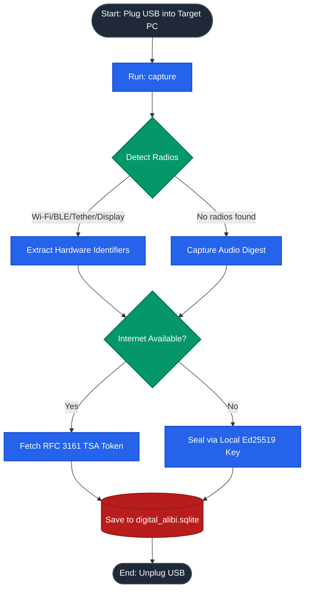
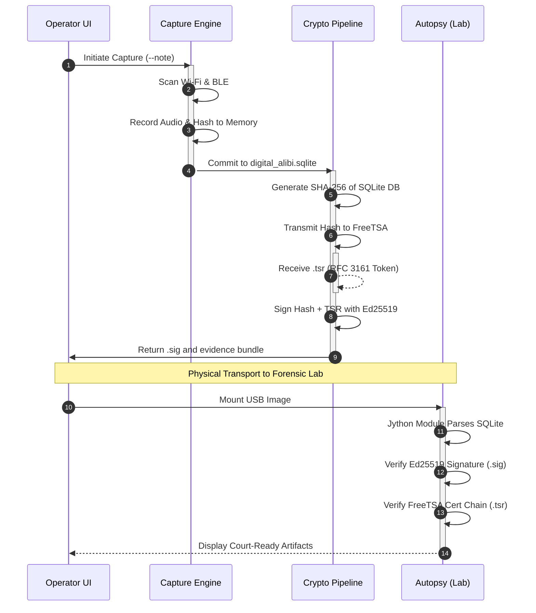

# Digital Alibi

**Digital Alibi** is a portable, plug-and-play forensic utility that proves a computer was in a specific physical room at a specific time. 

It does this by taking a snapshot of the invisible "radio room" around you (Wi-Fi routers, Bluetooth devices, Wired Networks, and Monitor Serial Numbers). It mathematically hashes that data and sends it to a recognized internet Time Authority (FreeTSA) to permanently lock the evidence.

> **Author:** Developed by **Junaid Nizam Quadri**, M.Tech in Information Security and Cyber Forensics.  
> **Version:** 1.0.0

---

## 🚀 Quick Start for Humans (No Coding Required)

You do not need to install Python or know how to code to use Digital Alibi! 

### Step 1: Capture the Evidence (The "Digital Alibi")
1. Download the pre-built application from the **GitHub Releases** tab (`DigitalAlibi.exe` for Windows, or `DigitalAlibi` for Linux).
2. Put the file on a fresh USB Drive.
3. Plug the USB drive into the target computer.
4. Open a terminal / command prompt inside the USB drive and run:
   ```bash
   # On Windows:
   DigitalAlibi-windows-x86_64.exe capture --note "Seizing laptop in suspect's living room"

   # On Linux:
   ./DigitalAlibi-linux-x86_64 capture --note "Seizing laptop in suspect's living room"
   ```
**That's it!** The tool will scan the environment and automatically generate a `digital_alibi.sqlite` evidence file and a cryptographically signed `.tsr` timestamp file directly on your USB drive.

### Step 2: Read the Evidence in Autopsy
We provide a 1-click installer so you can view your evidence beautifully in Autopsy.
1. Run `install_autopsy_plugin.bat` (Windows) or `./install_autopsy_plugin.sh` (Linux).
2. Open Autopsy.
3. Add your USB Drive (or the `digital_alibi.sqlite` file) as a Data Source.
4. Go to **Tools -> Run Ingest Modules**. Uncheck everything except **"Digital Alibi Environmental Evidence"** and hit Finish.
5. In the left-hand tree, scroll down to **Results -> Interesting Items -> Digital Alibi** to view your verified, court-ready hardware metrics and FreeTSA timestamp!

---

## 🧠 Advanced Documentation & Cryptographic Design
*(For Forensic Examiners, Lawyers, and Developers)*

### 1. Forensic scope and important limits
Digital Alibi is an **evidence-assistance tool**, not a determination of physical location, identity, guilt, or ownership.

- A Wi-Fi BSSID or BLE address indicates radio visibility, not a person’s identity or exact location.
- BLE addresses may rotate. Digital Alibi retains only MAC-form identifiers observed in **two separate scans**.
- Audio fallback retains no WAV, PCM, or recording file. It captures audio **only in memory**, hashes the PCM bytes, stores the digest, and releases the sample.
- RFC 3161 proves that a timestamp authority issued a token over the supplied digest.
- A locally generated Ed25519 signature establishes tamper evidence if the internet is down.

### 2. What it actually collects
| Source | Method | Stored evidence |
|---|---|---|
| Wi-Fi | Native OS command only: `netsh wlan`, `nmcli`, or `airport -s` | Sorted, de-duplicated BSSIDs, command outcome metadata |
| Bluetooth LE | `bleak`, two scans, intersection of MAC-form identifiers | Stable BLE hardware MACs and available RSSI values |
| Wired Networks / Tethering | Native OS command only: `arp -a` | Hardware MAC addresses of connected peers on the local subnet |
| External Displays | EDID capture (Windows: WMI/Registry, Linux: xrandr/sysfs, macOS: ioreg) | Connected monitor serial numbers, manufacturer IDs, and models |
| Audio fallback | `sounddevice`, 16 kHz mono PCM signed 16-bit, 10 seconds by default | SHA-256 of in-memory PCM, sample parameters, no audio content |

### 3. Architecture and Workflow


### 4. Cryptographic Sequence of Custody
*(Detailed horizontal data exchange)*


### 4. Zero-footprint definition
The core program confines every application-created persistent artifact to `os.getcwd()`:
| Artifact | Location |
|---|---|
| SQLite evidence database | `./digital_alibi.sqlite` |
| RFC 3161 tokens | `./tsr/<capture-id>.tsr` |
| USB-local offline signing key | `./digital_alibi_ed25519_private.pem` |
| USB-local public key | `./digital_alibi_ed25519_public.pem` |

### 5. Advanced Commands
If you want to run the tool continuously in a highly volatile environment (like an airport), use the `watch` command to take a cryptographically sealed snapshot every 60 seconds:
```bash
DigitalAlibi-linux-x86_64 watch --interval 60
```
Other commands:
```text
capture [--tsa-url HTTPS_URL] [--no-tsa] [--ble-seconds N] [--audio-seconds N] [--capture-id ID] [--note TEXT]
flush   [--tsa-url HTTPS_URL] [--limit N]
verify  [--capture-id ID]
status
```

### 6. Development and Building Portable Bundles
To compile this code yourself into standalone executables using PyInstaller:
```bash
python3 -m venv .venv
. .venv/bin/activate
python -m pip install -r requirements-build.txt
python build_forensic_usb.py
```
Output will be inside the `dist/` folder.

## Copyright and License
**PROPRIETARY AND CONFIDENTIAL**

Copyright &copy; 2026 **Junaid Nizam Quadri**. All Rights Reserved.

This repository is governed by a strict proprietary license (see the `LICENSE` file). 
* **Permission is Required:** You may not modify, distribute, or publish this code without explicit written consent from the author.
* **Mandatory Attribution:** Any authorized use or academic reference of this software must provide full credit to Junaid Nizam Quadri.

Please contact the author for licensing inquiries, academic usage permissions, or formal forensic validation.
